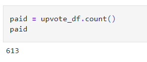
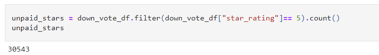
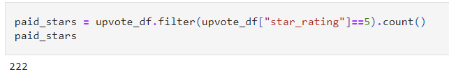

# Amazon_Vine_Analysis

## Overview of the analysis

## Results: 

### How many Vine reviews and non-Vine reviews were there?

Vine Reviews

Non Vine Reviews

### How many Vine reviews were 5 stars? How many non-Vine reviews were 5 stars?

Non Vine 5 Star:

Vine 5 Star:

## Deliverable 3 Requirements

### Summary: In your summary, state if there is any positivity bias for reviews in the Vine program. Use the results of your analysis to support your statement. Then, provide one additional analysis that you could do with the dataset to support your statement.

